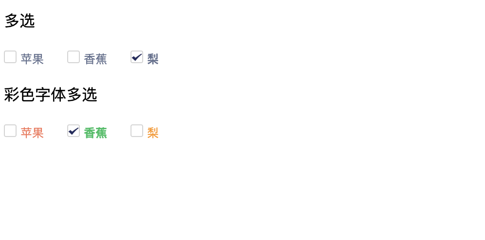

## react-beautiful-checkbox

* Created By ancf - (博客地址)[https://kafeihaoka.github.io/myBlog.html#/welcome]

* react-beautiful-checkbox 为一款基于react实现的多选框组件。



DEMO示例地址：https://kafeihaoka.github.io/react-beautiful-checkbox/

## 安装依赖
npm i react-beautiful-checkbox -S

## API 介绍

| Property | Description | Type | Default |
| --- | --- | --- | --- |
| options | 数据列表 | array | [] |
| defaultValue | 当前选中项 | array | [] |
| onChange | 点击事件 | function(e){} | - |

## 用法示例

```

import Checkbox from "react-beautiful-checkbox";

class RadioDemo extends React.Component {
    state = {
        tabValue : [],
        data: [{
          value: 'apple',
          label: '苹果',
        },{
          value: 'banana',
          label: '香蕉',
        },{
          value: 'pear',
          label: '梨',
        }]
    };

    handleChange = (e) => {
        this.setState({
            tabValue: e
        })
    }

  render() {
    const { data, tabValue } = this.state;
    return (
      <div>
        <Checkbox 
						options={data} 
						defaultValue={tabValue} 
						onChange={this.handleChange} /> 
      </div>
    );
  }
}

ReactDOM.render(<RadioDemo />, mountNode);

```

## 相关资料

- react  component  checkbox  react-beautiful-checkbox

